# 📚 BookSwapX

> A full-stack Java EE web application for college students to buy, sell, and exchange textbooks — with a smart auto-matching engine powered by a MySQL trigger.

---

## 🖼️ Screenshots

### 🏠 Landing Page
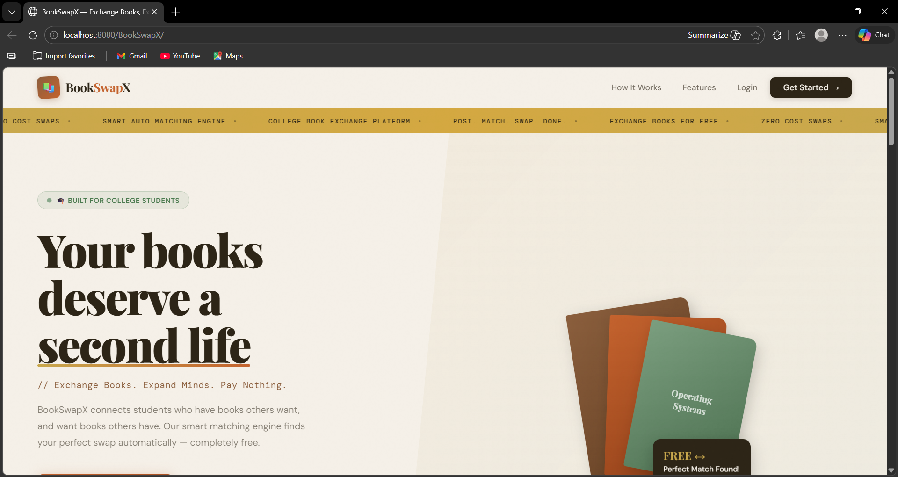
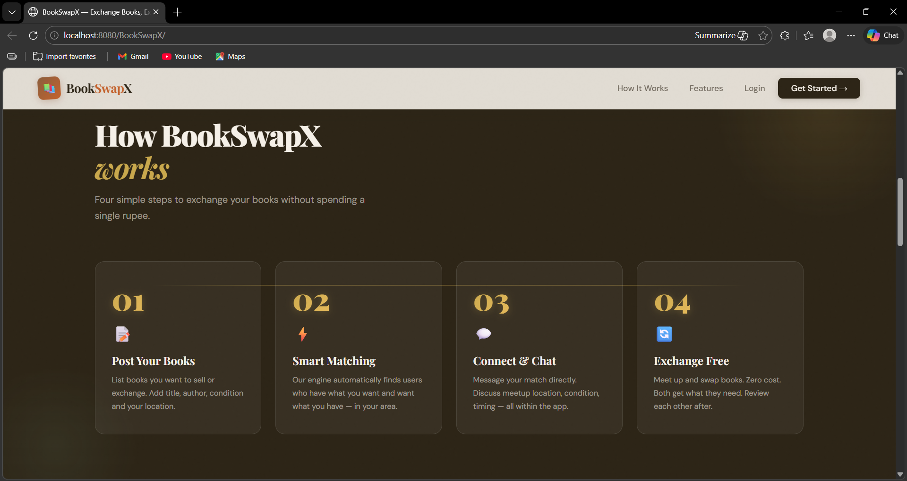
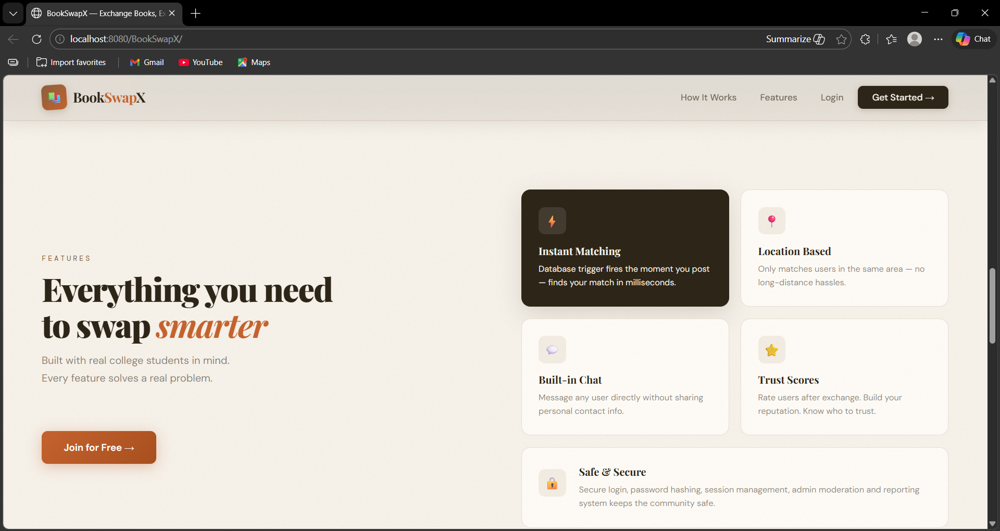

### 🔐 Authentication
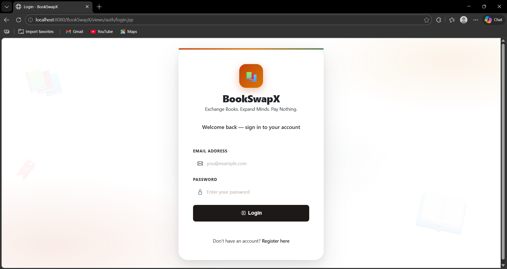
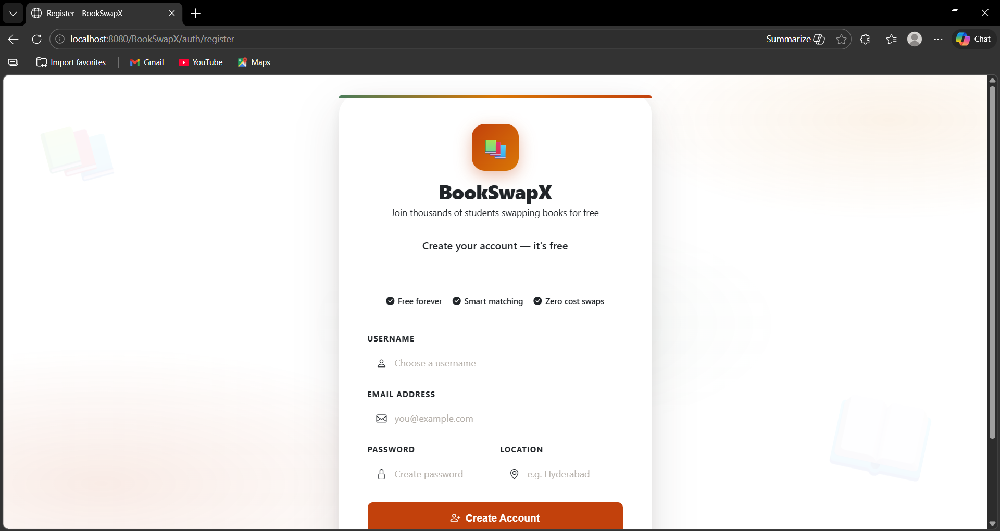

### 👤 User Pages
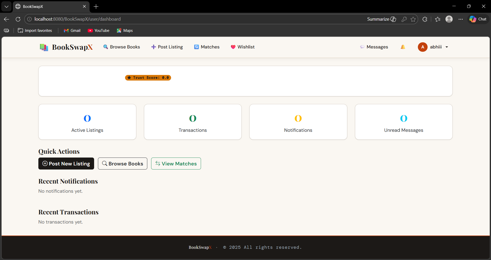
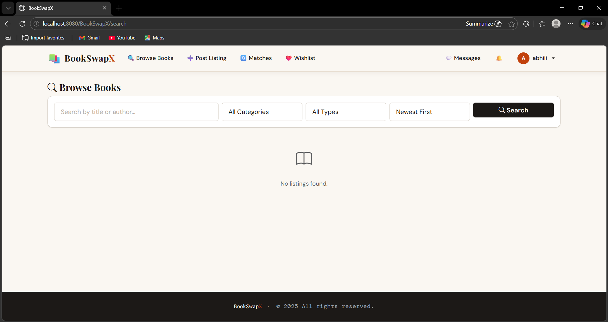
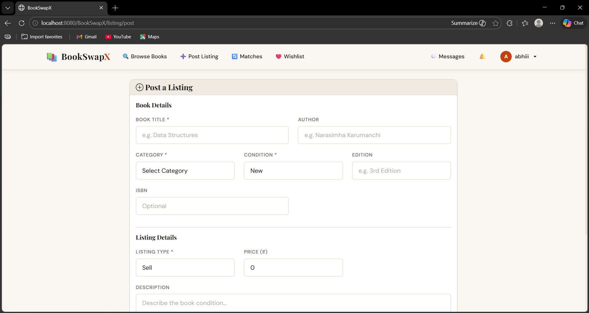
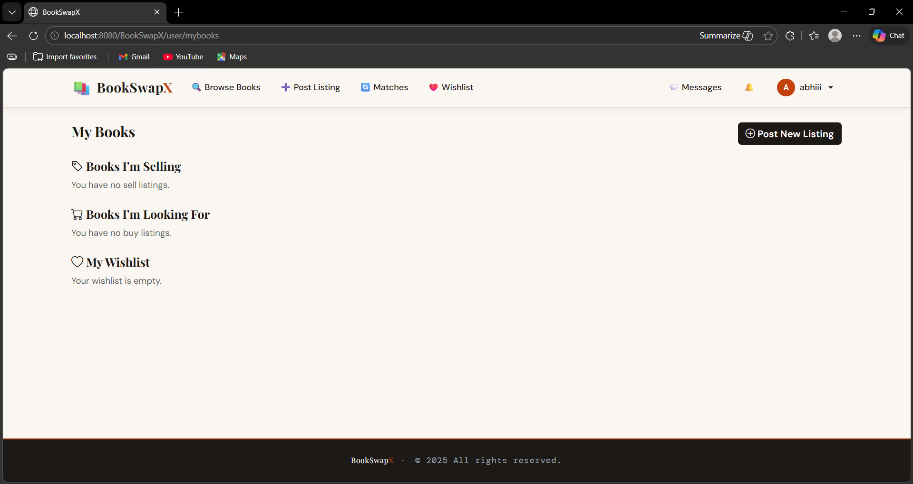
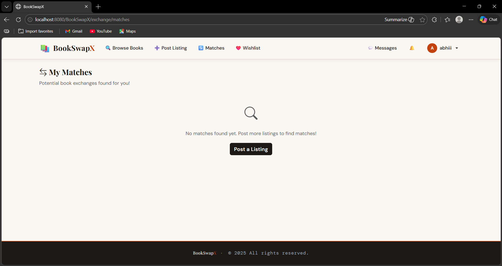
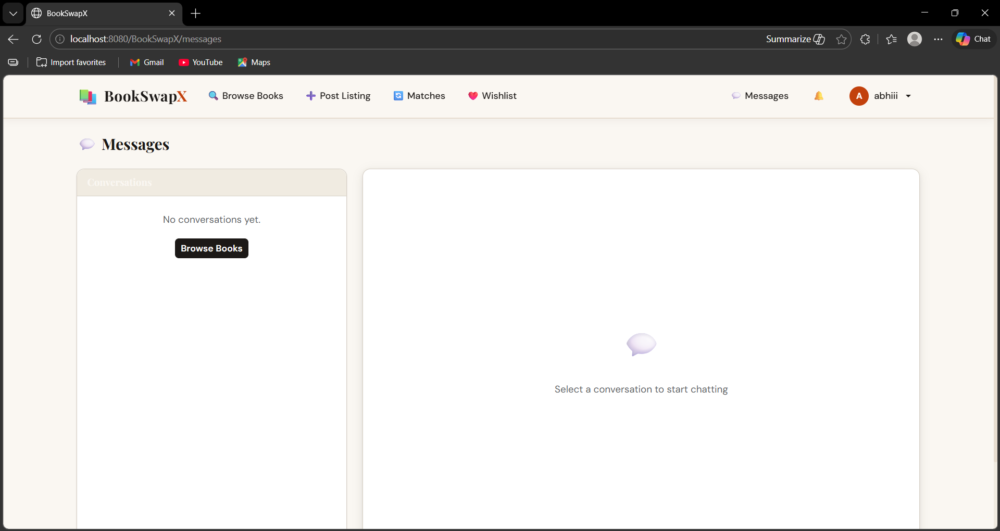
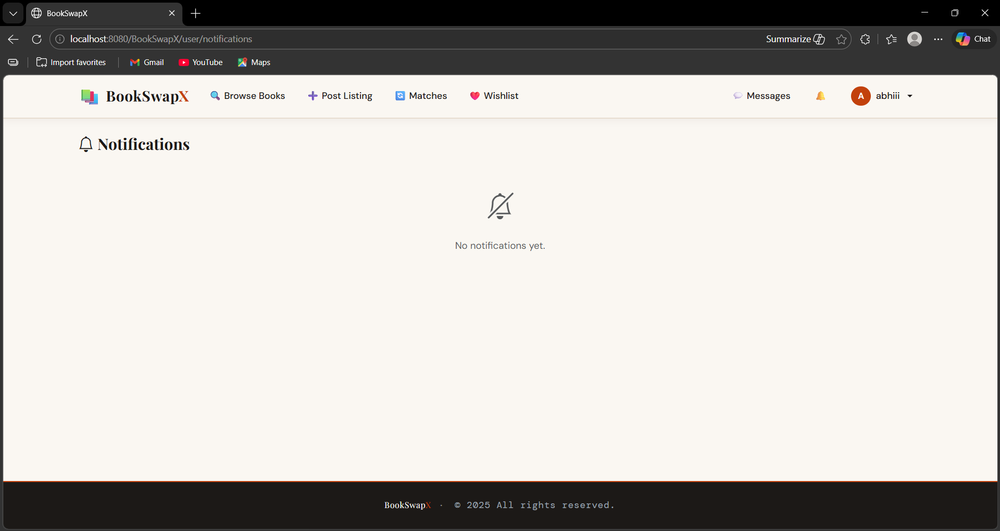

### 🛡️ Admin Pages
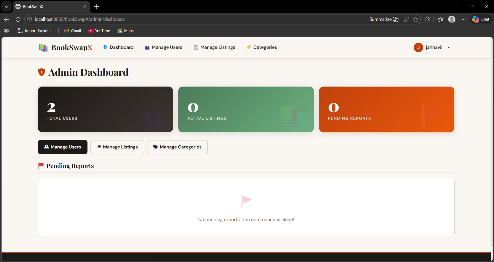

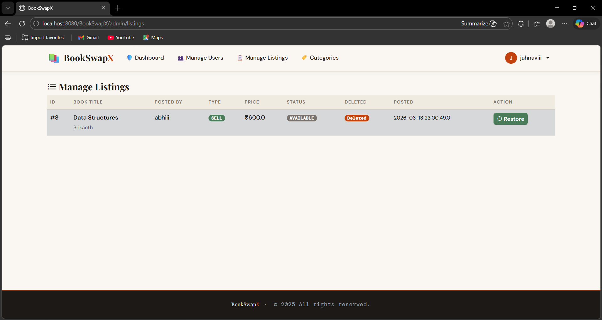
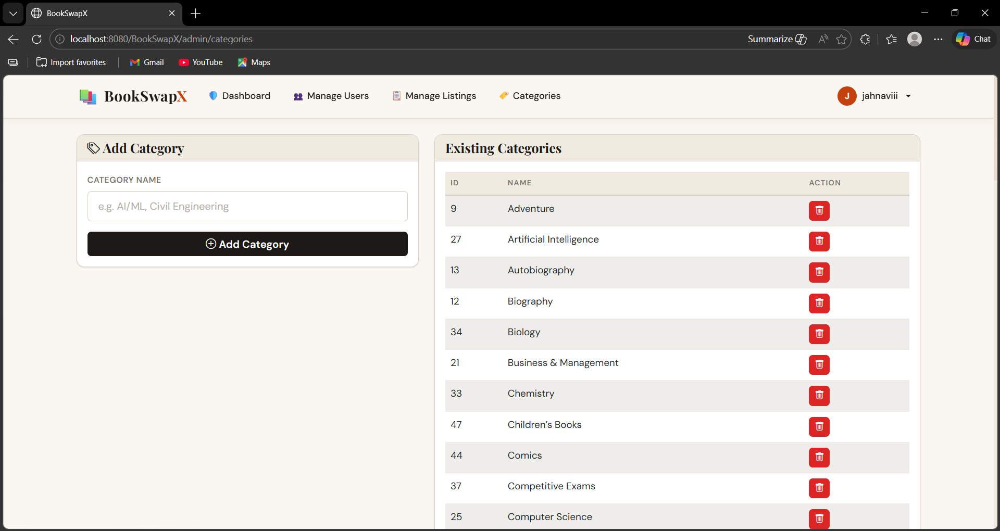

---

## 🌟 Features

| Feature | Description |
|--------|-------------|
| 🔐 Auth | Secure registration and login with MD5 password hashing |
| 📖 Marketplace | Post SELL and BUY listings for books |
| 🔄 Smart Matching | MySQL trigger auto-detects mutual exchange opportunities |
| 💸 Zero-Cost Exchange | Book swaps recorded at ₹0 — cost-zero logic |
| 💬 Messaging | Internal two-panel chat between users |
| ⭐ Trust Score | Peer review and rating system |
| 🛡️ Admin Panel | Block users, manage listings, categories, reports |
| 🔔 Notifications | In-app alerts for matches and requests |
| ❤️ Wishlist | Save books you are looking for |

---

## 🛠️ Tech Stack

| Layer | Technology |
|-------|-----------|
| Backend | Java EE (Jakarta Servlets) |
| View | JSP (Java Server Pages) — plain scriptlets, no JSTL |
| Database | MySQL 8.0 |
| Frontend | Bootstrap 5, HTML5, CSS3 |
| Server | Apache Tomcat 10.1 |
| IDE | Eclipse |
| DB Driver | MySQL Connector/J 9.5.0 |
| Password | MD5 hashing via Java MessageDigest |

---

## 🗂️ Project Structure

```
BookSwapX/
├── src/main/java/
│   ├── com.bookswapx.db/          DBConnection.java
│   ├── com.bookswapx.model/       12 POJO classes
│   ├── com.bookswapx.dao/         12 DAO classes
│   ├── com.bookswapx.filter/      AuthFilter, AdminFilter
│   ├── com.bookswapx.servlet/     19 Servlet controllers
│   └── com.bookswapx.util/        PasswordUtil.java
└── src/main/webapp/
    ├── css/
    │   └── theme.css
    ├── screenshots/               17 screenshots
    ├── uploads/
    │   └── profile_pictures/
    ├── views/
    │   ├── auth/       login.jsp, register.jsp
    │   ├── user/       dashboard.jsp, profile.jsp, mybooks.jsp
    │   ├── listing/    post-listing.jsp, listing-detail.jsp
    │   ├── exchange/   matches.jsp
    │   ├── message/    inbox.jsp
    │   ├── search/     search.jsp
    │   ├── admin/      dashboard.jsp, users.jsp, listings.jsp, categories.jsp
    │   └── common/     header.jsp, navbar.jsp, footer.jsp
    ├── WEB-INF/
    │   ├── web.xml
    │   └── lib/
    │       └── mysql-connector-j-9.5.0.jar
    └── index.jsp
```

---

## ⚙️ How to Run Locally

### Prerequisites
- Java JDK 17+
- Apache Tomcat 10.1
- MySQL 8.0
- Eclipse IDE (Enterprise Java Developers edition)

### Step 1 — Clone
```bash
git clone https://github.com/YOUR_USERNAME/BookSwapX.git
```

### Step 2 — Set Up Database
Open MySQL Workbench and run:
```sql
CREATE DATABASE bookswapx;
USE bookswapx;
-- then run all CREATE TABLE statements and the trigger
```

### Step 3 — Configure DB Credentials
Edit `src/main/java/com/bookswapx/db/DBConnection.java`:
```java
private static final String URL =
    "jdbc:mysql://localhost:3306/bookswapx?useSSL=false&serverTimezone=UTC&allowPublicKeyRetrieval=true";
private static final String USER = "root";
private static final String PASSWORD = "your_password_here";
```

### Step 4 — Add MySQL JAR
Place `mysql-connector-j-9.5.0.jar` inside:
```
src/main/webapp/WEB-INF/lib/
```

### Step 5 — Deploy on Tomcat
1. Import project in Eclipse → File → Import → Existing Projects
2. Right-click project → Run As → Run on Server → Tomcat 10.1
3. Open browser: `http://localhost:8080/BookSwapX/`

### Step 6 — Create Admin Account
Register a normal account first, then run this SQL:
```sql
UPDATE users SET role = 'ADMIN' WHERE email = 'your@email.com';
```
Log out and log back in — you will see the Admin panel in the navbar.

---

## 🗄️ Database Tables (12)

| Table | Purpose |
|-------|---------|
| `users` | Registered users, roles, trust scores, active status |
| `books` | Book metadata — title, author, condition, edition |
| `categories` | Academic branches — CSE, ECE, Mechanical, etc. |
| `listings` | Buy/Sell listings with soft delete |
| `potential_matches` | Auto-detected exchange pairs via trigger |
| `exchange_requests` | Formal exchange request tracking |
| `messages` | Internal user-to-user chat |
| `reviews` | Star ratings and comments |
| `transaction_history` | Permanent record of all completed deals |
| `notifications` | In-app alerts for activity |
| `reports` | User-flagged listings for admin review |
| `wishlist` | Books saved by users |

---

## ⚡ Auto-Match Trigger

The smartest feature of BookSwapX. A **MySQL TRIGGER** fires automatically after every listing insert:

```
User A posts "Java Programming" (SELL) + "Data Structures" (BUY)
User B posts "Data Structures" (SELL) + "Java Programming" (BUY)
         ↓
Trigger detects mutual match + same location
         ↓
Inserts into potential_matches
         ↓
Both users get notified instantly
         ↓
Exchange happens at ₹0 (zero cost)
```

---

## 🔑 Key Design Decisions

**Soft Delete** — Listings are never truly deleted. `is_deleted = TRUE` hides them while preserving all transaction history.

**PreparedStatement** — All SQL uses `?` placeholders. Zero SQL injection risk.

**Stream API** — Search filtering and sorting use `.stream().filter().sorted().collect()` — clean, readable, no complex SQL joins.

**Role-Based Filters** — Two `@WebFilter` classes protect all pages. AdminFilter checks role before any admin page loads.

**Cost-Zero Logic** — Exchange transactions save `price = 0.00` and `is_exchange = true`. Dashboard shows FREE for these.

---

## 📊 Project Stats

```
Database tables  →  12
POJO classes     →  12
DAO classes      →  12
Servlet classes  →  19
JSP pages        →  18+
Security filters →   2
MySQL triggers   →   1
Screenshots      →  17
```

---

## 🚀 Future Enhancements

- [ ] Razorpay payment gateway integration
- [ ] Profile picture upload with MultipartConfig
- [ ] Email OTP verification on registration
- [ ] Relative timestamps — "Posted 2 days ago"
- [ ] Pagination for large listing results
- [ ] Password change from profile page

---

## 👤 Author

**Your Name** — B.Tech Computer Science  
[LinkedIn](https://linkedin.com/in/yourprofile) | [GitHub](https://github.com/YOUR_USERNAME)

---

## 📄 License

MIT License — open source, free to use and modify.